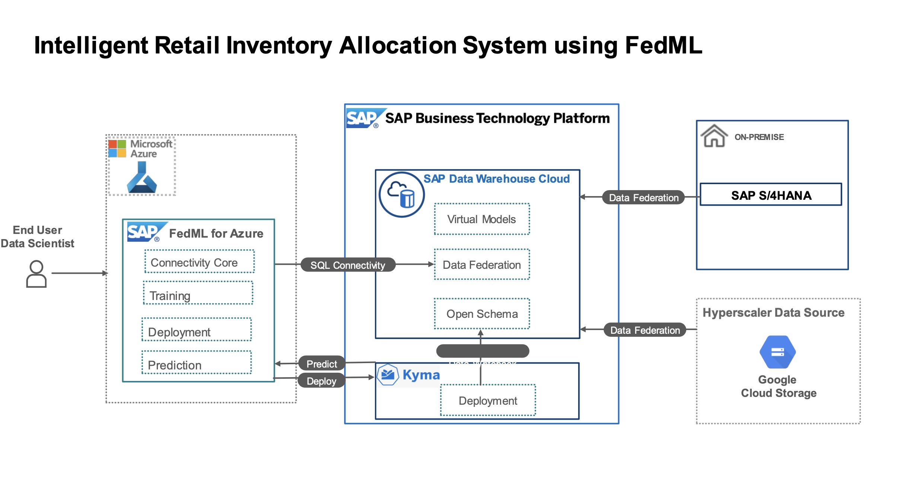

# Retail Inventory prediction and comparative retail consumption analysis using FedML

## Description
Explore how to use SAP Data Warehouse Cloud and  FedML hyperscaler libraries to source data , build,train and deploy machine learning models on hyperscaler platforms for predicting inventory allocations , and to do comparative retail consumption analysis and derive insights using SAP Analytics cloud - all without data duplication.

## Solution Architecture

## Challenges
In general cases, for conducting machine learning experiments on hyperscaler platforms, the data often have to be extracted out of source business systems and duplicated in cloud stores of the ML platform. This causes issues such as data inconsistencies and increased TCO resulting from additional data storage costs due to data duplication and expensive data pipelines. Moreover comparitive retail consumption analysis on live data is not currently possible with data from cross cloud sources. 

## Solution
FedML python libraries for hyperscalers helps create an end to end automated solution for doing the ML experiments on hyperscalers without moving or duplicating any data to the hyperscaler. The models are deployed on SAP BTP Kyma. The solution uses SAP DWC's data federation architecture and a unified semantic layer that helps model the queries across distributed data sources without the need do extract any data out from anywhere. SAP Analytics Cloud helps visualize live data to compare retail inventory predictions against the live inventory consumption data coming in from online retail platforms.

## Requirements

* SAP BTP Subaccount with Kyma  subscription enabled.
* SAP Data Warehouse Cloud instance
* SAP Analytics Cloud instance
* MS Azure cloud subscription with permissions to create service principal acccounts.

## Download and Installation
* [Sign up for BTP Trial acount and enable Kyma](https://developers.sap.com/tutorials/hcp-create-trial-account.html)
* [Enable Kyma Runtime](https://developers.sap.com/tutorials/cp-kyma-getting-started.html)
* [Sign up for SAP Data Warehouse cloud trial](https://www.sap.com/products/data-warehouse-cloud/trial.html)
* [Run the Retail_Project.ipynb](https://github.com/SAP-samples/data-warehouse-cloud-fedml-retail-inventory/blob/main/Retail_project.ipynb)

## Limitations
This example contains no known limitations.

## Known Issues
This example contains no known issues.

## How to obtain support
This project is provided "as-is" with no expectation for major changes or support.

[Create an issue](https://github.com/SAP-samples//issues) in this repository if you find a bug or have questions about the content.

For additional support, [ask a question in SAP Community](https://answers.sap.com/questions/ask.html).

## License
Copyright (c) 2022 SAP SE or an SAP affiliate company. All rights reserved. This project is licensed under the Apache Software License, version 2.0 except as noted otherwise in the [LICENSE](LICENSES/Apache-2.0.txt) file.
